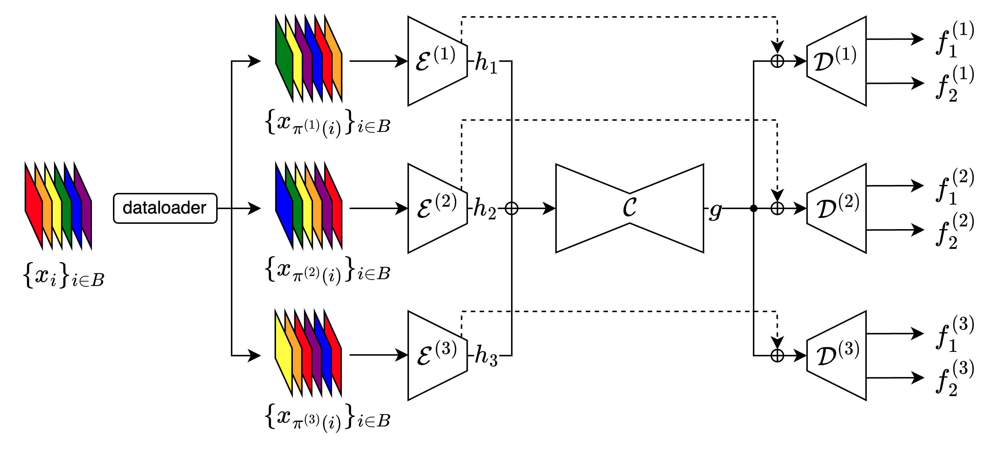

<a target="_blank" href="https://colab.research.google.com/github/antonbaumann/MIMO-Unet/blob/main/MIMO_U_Net_NYUv2_depth.ipynb">
  
</a>

# Probabilistic MIMO U-Net



## Installation
```bash
pip install -r requirements.txt
git clone https://github.com/oceanites/sen12tp.git GOAL_PATH
export PYTHONPATH=$PYTHONPATH:GOAL_PATH
```

## Training
The training scripts are located in the `scripts/train/` folder. The following scripts are available:

### NDVI
Train a MIMO U-Net with two subnetworks and `input repetition` for NDVI prediction on the SEN12TP dataset.
```bash
python train_ndvi.py \
  --dataset_dir /scratch/trossberg/sen12tp-v1-split1 \
  --checkpoint_path /ws/data/wandb_ndvi \
  --max_epochs 100 \
  --batch_size 32 \
  --num_subnetworks 2 \
  --filter_base_count 30 \
  --num_workers 30 \
  -t NDVI \
  -i VV_sigma0 \
  -i VH_sigma0 \
  --patch_size 256 \
  --stride 249 \
  --learning_rate 0.001 \
  --input_repetition_probability 0.0 \
  --loss_buffer_size 10 \
  --loss_buffer_temperature 0.3 \
  --core_dropout_rate 0.0 \
  --encoder_dropout_rate 0.0 \
  --decoder_dropout_rate 0.0 \
  --loss laplace_nll \
  --seed 1 \
  --project "NDVI Baselines"
```

### NYU Depth V2
Train a MIMO U-Net with two subnetworks and `input repetition` for depth prediction on the NYU Depth V2 dataset.
```bash
python train_nyuv2_depth.py \
  --dataset_dir /ws/data/nyuv2/depth \
  --checkpoint_path /ws/data/wandb_experiments_2 \
  --max_epochs 100 \
  --batch_size 64 \
  --num_subnetworks 2 \
  --filter_base_count 21 \
  --num_workers 50 \
  --learning_rate 0.001 \
  --input_repetition_probability 0.0 \
  --loss_buffer_size 10 \
  --loss_buffer_temperature 0.3 \
  --core_dropout_rate 0.0 \
  --encoder_dropout_rate 0.0 \
  --decoder_dropout_rate 0.0 \
  --loss laplace_nll \
  --seed 1 \
  --train_dataset_fraction 1 \
  --project "MIMO NYUv2Depth M"
```

For Monte-Carlo Dropout, set `--core_dropout_rate 0.1`, `--encoder_dropout_rate 0.1`, `--decoder_dropout_rate 0.1`.

## Evaluation
The evaluation scripts are located in the `scripts/test/` folder.
These scripts evaluate a trained model on a dataset and save the results in the specified result directory.
1. `{dataset_name}_{epsilon}_inputs.npy`: Inputs to the model.
2. `{dataset_name}_{epsilon}_y_trues.npy`: Targets of the model.
3. `{dataset_name}_{epsilon}_y_preds.npy`: Predictions of the model.
4. `{dataset_name}_{epsilon}_aleatoric_vars.npy`: Aleatoric uncertainty (variance) of the model.
5. `{dataset_name}_{epsilon}_epistemic_vars.npy`: Epistemic uncertainty (variance) of the model.
6. `{dataset_name}_{epsilon}_df_pixels.csv`: Dataframe with all information above per pixel.
7. `{dataset_name}_{epsilon}_precision_recall.csv`: Dataframe for precision-recall curve.
8. `{dataset_name}_{epsilon}_calibration.csv`: Dataframe for calibration curve.


### NDVI
Evaluate a trained model for NDVI prediction on the SEN12TP dataset.
```bash
python test_ndvi.py \
  --dataset_dir PATH_TO_DATASET/test/ \
  --model_checkpoint_path PATH_TO_CHECKPOINT/model.ckpt \ 
  --result_dir PATH_TO_RESULT_DIR \
  --processes 5
```

### NYU Depth V2
Evaluate a trained model for depth prediction on the NYU Depth V2 dataset.
```bash
python test_nyuv2_depth.py \
  --model_checkpoint_paths PATH_TO_CHECKPOINT/model.ckpt \
  --dataset_dir PATH_TO_DATASET \
  --result_dir PATH_TO_RESULT_DIR \
  --processes 5
```